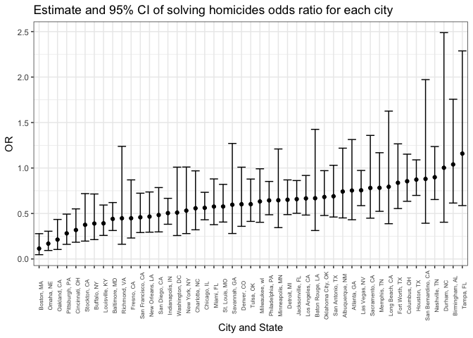
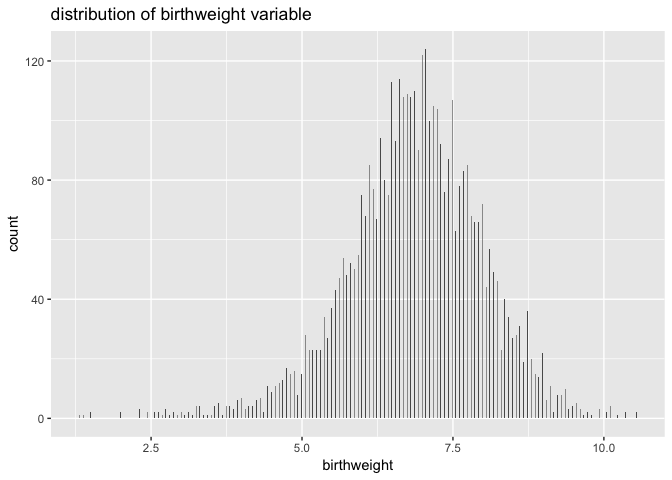
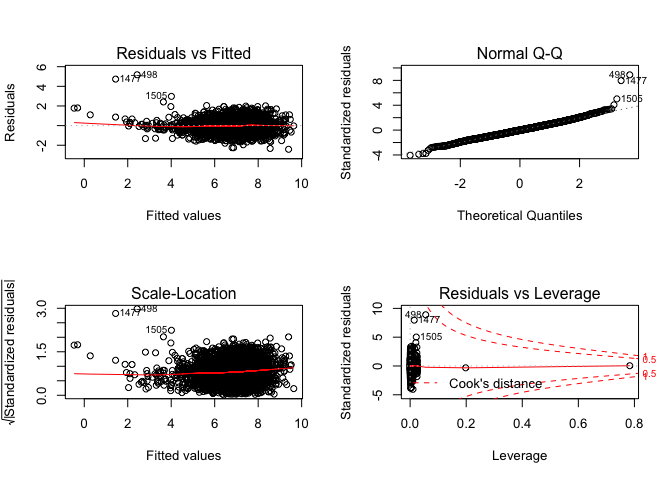
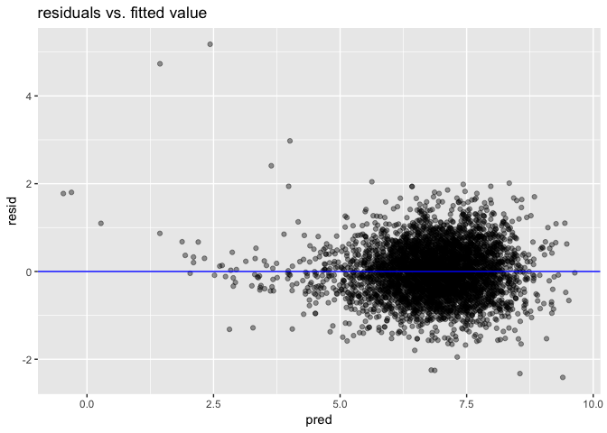
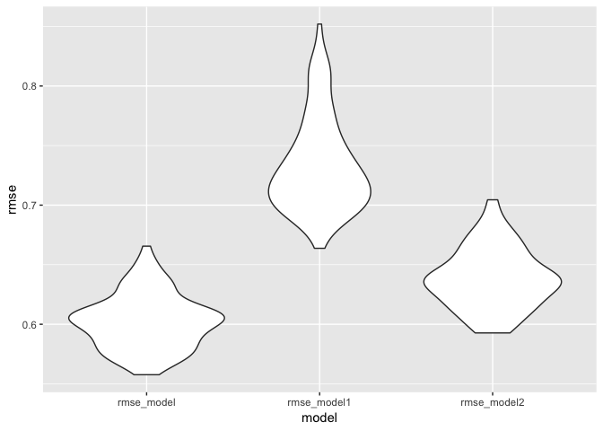

Jr3869\_hw9
================
Jingwei Ren
11/26/2018

### problem 1

Create a city\_state variable (e.g. “Baltimore, MD”), and a binary variable indicating whether the homicide is solved. Omit cities Dallas, TX; Phoenix, AZ; and Kansas City, MO – these don’t report victim race. Also omit Tulsa, AL – this is a data entry mistake. Modifiy victim\_race to have categories white and non-white, with white as the reference category. Be sure that victim\_age is numeric.

``` r
homicide= read_csv("./data/homicide-data.csv") 
```

    ## Parsed with column specification:
    ## cols(
    ##   uid = col_character(),
    ##   reported_date = col_integer(),
    ##   victim_last = col_character(),
    ##   victim_first = col_character(),
    ##   victim_race = col_character(),
    ##   victim_age = col_character(),
    ##   victim_sex = col_character(),
    ##   city = col_character(),
    ##   state = col_character(),
    ##   lat = col_double(),
    ##   lon = col_double(),
    ##   disposition = col_character()
    ## )

``` r
homicide_tidy= homicide %>% 
  mutate(city_state = str_c(city, state, sep = ", "),
         homi_status = as.numeric(disposition == "Closed by arrest")) %>% 
  filter(!city_state %in% c("Dallas, TX","Phoenix, AZ", "Kansas City, MO", "Tulsa, AL")) %>%
  mutate(victim_race = fct_relevel(ifelse(victim_race == "White", "white", "non-white"), "white"),
victim_age = as.numeric(victim_age))
```

    ## Warning in evalq(as.numeric(victim_age), <environment>): NAs introduced by
    ## coercion

For the city of Baltimore, MD, use the glm function to fit a logistic regression with resolved vs unresolved as the outcome and victim age, sex and race (as just defined) as predictors. Save the output of glm as an R object; apply the broom::tidy to this object; and obtain the estimate and confidence interval of the adjusted odds ratio for solving homicides comparing non-white victims to white victims keeping all other variables fixed.

``` r
baltimore = homicide_tidy %>% 
  filter(city_state == "Baltimore, MD")

logistic = 
  baltimore %>% 
  stats::glm(homi_status ~ victim_age + victim_sex + victim_race, data = ., family = binomial())

logistic %>% 
  broom::tidy() %>%  # give log odds ratio
  mutate(OR = exp(estimate), # transform back
         conf.low = exp(estimate - std.error*1.96),
         conf.high = exp(estimate + std.error*1.96)) %>%
  select(term, log_OR = estimate, OR, conf.low, conf.high) %>% 
  filter(term == "victim_raceNonwhite") %>%
  knitr::kable(digits = 3)
```

| term    |    log\_OR|     OR|     conf.low|                                                                                              conf.high|
|:--------|----------:|------:|------------:|------------------------------------------------------------------------------------------------------:|
| The res |  ult of lo|  gisti|  c model sho|  wed that the estimate of the adjusted odds ratio is 0.441, with confidence interval from (0.31, 0.62)|

Now run glm for each of the cities in your dataset, and extract the adjusted odds ratio (and CI) for solving homicides comparing non-white victims to white victims. Do this within a “tidy” pipeline, making use of purrr::map, list columns, and unnest as necessary to create a dataframe with estimated ORs and CIs for each city.

``` r
each_city = homicide_tidy %>% 
  group_by(city_state) %>% 
  nest()
OR_summary = each_city %>% 
  mutate(models = map(data, ~ stats::glm(homi_status ~ victim_age + victim_sex + victim_race, data = .x, family = binomial())),
    models = map(models, broom::tidy)) %>% 
  select(-data) %>% 
  unnest() %>% 
  filter(term == "victim_racenon-white") %>% 
  mutate(OR = exp(estimate),
         conf.low = exp(estimate - std.error*1.96),
         conf.high= exp(estimate + std.error*1.96)) %>%
  select(city_state, term, log_OR = estimate, OR, conf.low, conf.high) 
```

Create a plot that shows the estimated ORs and CIs for each city. Organize cities according to estimated OR, and comment on the plot.

``` r
OR_summary %>% 
  mutate(city_state = fct_reorder(city_state, OR)) %>% 
  ggplot(aes(x = city_state, y = OR)) + geom_point() + 
  geom_errorbar(mapping = aes(ymin = conf.low, ymax = conf.high)) +
  theme_bw() +
  theme(legend.position = "bottom",
        legend.direction = "horizontal",
        axis.text.x = element_text(angle = 90, size = 6))+
  labs(title = "Estimate and 95% CI of solving homicides odds ratio for each city", 
         x = "City and State", 
         y = "OR") 
```



Based on the plot, the estimate odds ratio of solving homicides comparing non-white vitctims to white victims varies cross different states and cities. The estimates are mostly lower than one, which menas that homicides in which the victim is non-white are less likely to be resolved compared to those in which the victim is white.

### problem 2

Load and clean the data for regression analysis (i.e. convert numeric to factor where appropriate, check for missing data, etc.).

``` r
birthweight =  read_csv("./data/birthweight.csv")
```

    ## Parsed with column specification:
    ## cols(
    ##   .default = col_integer(),
    ##   gaweeks = col_double(),
    ##   ppbmi = col_double(),
    ##   smoken = col_double()
    ## )

    ## See spec(...) for full column specifications.

``` r
birth_tidy =
  birthweight %>% 
  janitor::clean_names() %>%
  mutate(babysex = as.factor(recode(babysex, `1` = 0, `2` = 1)),
         frace = as.factor(frace), 
         mrace = as.factor(mrace),
         malform = as.factor(malform), 
         bhead = as.numeric(bhead),
         bwt = bwt*0.0022)

skimr::skim(birth_tidy) 
```

    ## Skim summary statistics
    ##  n obs: 4342 
    ##  n variables: 20 
    ## 
    ## ── Variable type:factor ───────────────────────────────────────────────────────────────────
    ##  variable missing complete    n n_unique                      top_counts
    ##   babysex       0     4342 4342        2         0: 2230, 1: 2112, NA: 0
    ##     frace       0     4342 4342        5 1: 2123, 2: 1911, 4: 248, 3: 46
    ##   malform       0     4342 4342        2           0: 4327, 1: 15, NA: 0
    ##     mrace       0     4342 4342        4 1: 2147, 2: 1909, 4: 243, 3: 43
    ##  ordered
    ##    FALSE
    ##    FALSE
    ##    FALSE
    ##    FALSE
    ## 
    ## ── Variable type:integer ──────────────────────────────────────────────────────────────────
    ##  variable missing complete    n     mean    sd  p0 p25 p50 p75 p100
    ##   blength       0     4342 4342  49.75    2.72  20  48  50  51   63
    ##     delwt       0     4342 4342 145.57   22.21  86 131 143 157  334
    ##   fincome       0     4342 4342  44.11   25.98   0  25  35  65   96
    ##  menarche       0     4342 4342  12.51    1.48   0  12  12  13   19
    ##   mheight       0     4342 4342  63.49    2.66  48  62  63  65   77
    ##    momage       0     4342 4342  20.3     3.88  12  18  20  22   44
    ##    parity       0     4342 4342   0.0023  0.1    0   0   0   0    6
    ##   pnumlbw       0     4342 4342   0       0      0   0   0   0    0
    ##   pnumsga       0     4342 4342   0       0      0   0   0   0    0
    ##      ppwt       0     4342 4342 123.49   20.16  70 110 120 134  287
    ##    wtgain       0     4342 4342  22.08   10.94 -46  15  22  28   89
    ##      hist
    ##  ▁▁▁▁▁▇▁▁
    ##  ▁▇▅▁▁▁▁▁
    ##  ▁▂▇▂▂▂▁▃
    ##  ▁▁▁▁▂▇▁▁
    ##  ▁▁▁▅▇▂▁▁
    ##  ▂▇▅▂▁▁▁▁
    ##  ▇▁▁▁▁▁▁▁
    ##  ▁▁▁▇▁▁▁▁
    ##  ▁▁▁▇▁▁▁▁
    ##  ▁▇▆▁▁▁▁▁
    ##  ▁▁▁▇▇▁▁▁
    ## 
    ## ── Variable type:numeric ──────────────────────────────────────────────────────────────────
    ##  variable missing complete    n  mean   sd    p0   p25   p50   p75  p100
    ##     bhead       0     4342 4342 33.65 1.62 21    33    34    35    41   
    ##       bwt       0     4342 4342  6.85 1.13  1.31  6.18  6.89  7.61 10.54
    ##   gaweeks       0     4342 4342 39.43 3.15 17.7  38.3  39.9  41.1  51.3 
    ##     ppbmi       0     4342 4342 21.57 3.18 13.07 19.53 21.03 22.91 46.1 
    ##    smoken       0     4342 4342  4.15 7.41  0     0     0     5    60   
    ##      hist
    ##  ▁▁▁▁▅▇▁▁
    ##  ▁▁▁▃▇▇▂▁
    ##  ▁▁▁▁▃▇▁▁
    ##  ▁▇▅▁▁▁▁▁
    ##  ▇▁▁▁▁▁▁▁

babysex, frace, mrace, malfrom are changed to factor variables. brithweight are changed to pounds.

Propose a regression model for birthweight. This model may be based on a hypothesized structure for the factors that underly birthweight, on a data-driven model-building process, or a combination of the two. Describe your modeling process and show a plot of model residuals against fitted values – use add\_predictions and add\_residuals in making this plot.

``` r
birth_tidy %>% 
  ggplot(aes(x = bwt)) + 
  geom_bar()+
  labs(x = "birthweight",
       title = "distribution of birthweight variable") 
```



the birthweight is approximately normally distributed.

backward eliminiation method, regression model and non-significant variables are taken out one at a time

``` r
mult.fit = lm(bwt ~ ., data = birth_tidy)
step(mult.fit, direction='backward')
```

    ## Start:  AIC=-4422.15
    ## bwt ~ babysex + bhead + blength + delwt + fincome + frace + gaweeks + 
    ##     malform + menarche + mheight + momage + mrace + parity + 
    ##     pnumlbw + pnumsga + ppbmi + ppwt + smoken + wtgain
    ## 
    ## 
    ## Step:  AIC=-4422.15
    ## bwt ~ babysex + bhead + blength + delwt + fincome + frace + gaweeks + 
    ##     malform + menarche + mheight + momage + mrace + parity + 
    ##     pnumlbw + pnumsga + ppbmi + ppwt + smoken
    ## 
    ## 
    ## Step:  AIC=-4422.15
    ## bwt ~ babysex + bhead + blength + delwt + fincome + frace + gaweeks + 
    ##     malform + menarche + mheight + momage + mrace + parity + 
    ##     pnumlbw + ppbmi + ppwt + smoken
    ## 
    ## 
    ## Step:  AIC=-4422.15
    ## bwt ~ babysex + bhead + blength + delwt + fincome + frace + gaweeks + 
    ##     malform + menarche + mheight + momage + mrace + parity + 
    ##     ppbmi + ppwt + smoken
    ## 
    ##            Df Sum of Sq    RSS     AIC
    ## - frace     4      0.60 1552.9 -4428.5
    ## - malform   1      0.01 1552.3 -4424.1
    ## - ppbmi     1      0.03 1552.3 -4424.1
    ## - momage    1      0.14 1552.4 -4423.8
    ## - mheight   1      0.32 1552.6 -4423.2
    ## - menarche  1      0.54 1552.8 -4422.6
    ## - ppwt      1      0.63 1552.9 -4422.4
    ## <none>                  1552.3 -4422.2
    ## - fincome   1      0.94 1553.2 -4421.5
    ## - parity    1      2.00 1554.3 -4418.6
    ## - mrace     3      4.20 1556.5 -4416.4
    ## - babysex   1      4.13 1556.4 -4412.6
    ## - gaweeks   1     22.32 1574.6 -4362.2
    ## - smoken    1     24.57 1576.9 -4356.0
    ## - delwt     1     38.76 1591.1 -4317.1
    ## - blength   1    493.92 2046.2 -3224.6
    ## - bhead     1    515.63 2067.9 -3178.8
    ## 
    ## Step:  AIC=-4428.47
    ## bwt ~ babysex + bhead + blength + delwt + fincome + gaweeks + 
    ##     malform + menarche + mheight + momage + mrace + parity + 
    ##     ppbmi + ppwt + smoken
    ## 
    ##            Df Sum of Sq    RSS     AIC
    ## - malform   1      0.01 1552.9 -4430.5
    ## - ppbmi     1      0.03 1552.9 -4430.4
    ## - momage    1      0.14 1553.0 -4430.1
    ## - mheight   1      0.34 1553.2 -4429.5
    ## - menarche  1      0.56 1553.5 -4428.9
    ## - ppwt      1      0.65 1553.6 -4428.7
    ## <none>                  1552.9 -4428.5
    ## - fincome   1      0.94 1553.8 -4427.8
    ## - parity    1      2.01 1554.9 -4424.9
    ## - babysex   1      4.12 1557.0 -4419.0
    ## - gaweeks   1     22.39 1575.3 -4368.3
    ## - smoken    1     24.38 1577.3 -4362.8
    ## - delwt     1     38.78 1591.7 -4323.4
    ## - mrace     3     65.54 1618.4 -4255.0
    ## - blength   1    493.66 2046.6 -3231.9
    ## - bhead     1    516.25 2069.2 -3184.3
    ## 
    ## Step:  AIC=-4430.45
    ## bwt ~ babysex + bhead + blength + delwt + fincome + gaweeks + 
    ##     menarche + mheight + momage + mrace + parity + ppbmi + ppwt + 
    ##     smoken
    ## 
    ##            Df Sum of Sq    RSS     AIC
    ## - ppbmi     1      0.03 1553.0 -4432.4
    ## - momage    1      0.14 1553.0 -4432.1
    ## - mheight   1      0.34 1553.2 -4431.5
    ## - menarche  1      0.56 1553.5 -4430.9
    ## - ppwt      1      0.65 1553.6 -4430.6
    ## <none>                  1552.9 -4430.5
    ## - fincome   1      0.94 1553.8 -4429.8
    ## - parity    1      2.01 1554.9 -4426.8
    ## - babysex   1      4.12 1557.0 -4420.9
    ## - gaweeks   1     22.38 1575.3 -4370.3
    ## - smoken    1     24.37 1577.3 -4364.8
    ## - delwt     1     38.86 1591.8 -4325.1
    ## - mrace     3     65.60 1618.5 -4256.8
    ## - blength   1    493.72 2046.6 -3233.8
    ## - bhead     1    516.31 2069.2 -3186.1
    ## 
    ## Step:  AIC=-4432.36
    ## bwt ~ babysex + bhead + blength + delwt + fincome + gaweeks + 
    ##     menarche + mheight + momage + mrace + parity + ppwt + smoken
    ## 
    ##            Df Sum of Sq    RSS     AIC
    ## - momage    1      0.14 1553.1 -4434.0
    ## - menarche  1      0.57 1553.5 -4432.8
    ## <none>                  1553.0 -4432.4
    ## - fincome   1      0.94 1553.9 -4431.7
    ## - parity    1      2.00 1555.0 -4428.8
    ## - babysex   1      4.11 1557.1 -4422.9
    ## - mheight   1      5.22 1558.2 -4419.8
    ## - ppwt      1     14.20 1567.2 -4394.8
    ## - gaweeks   1     22.37 1575.3 -4372.3
    ## - smoken    1     24.39 1577.3 -4366.7
    ## - delwt     1     38.84 1591.8 -4327.1
    ## - mrace     3     65.59 1618.5 -4258.7
    ## - blength   1    493.77 2046.7 -3235.6
    ## - bhead     1    517.02 2070.0 -3186.6
    ## 
    ## Step:  AIC=-4433.96
    ## bwt ~ babysex + bhead + blength + delwt + fincome + gaweeks + 
    ##     menarche + mheight + mrace + parity + ppwt + smoken
    ## 
    ##            Df Sum of Sq    RSS     AIC
    ## - menarche  1      0.48 1553.6 -4434.6
    ## <none>                  1553.1 -4434.0
    ## - fincome   1      1.17 1554.3 -4432.7
    ## - parity    1      2.09 1555.2 -4430.1
    ## - babysex   1      4.07 1557.2 -4424.6
    ## - mheight   1      5.21 1558.3 -4421.4
    ## - ppwt      1     14.10 1567.2 -4396.7
    ## - gaweeks   1     22.63 1575.7 -4373.1
    ## - smoken    1     24.42 1577.5 -4368.2
    ## - delwt     1     38.72 1591.8 -4329.0
    ## - mrace     3     70.99 1624.1 -4245.9
    ## - blength   1    493.63 2046.7 -3237.6
    ## - bhead     1    517.22 2070.3 -3187.8
    ## 
    ## Step:  AIC=-4434.61
    ## bwt ~ babysex + bhead + blength + delwt + fincome + gaweeks + 
    ##     mheight + mrace + parity + ppwt + smoken
    ## 
    ##           Df Sum of Sq    RSS     AIC
    ## <none>                 1553.6 -4434.6
    ## - fincome  1      1.19 1554.8 -4433.3
    ## - parity   1      2.05 1555.6 -4430.9
    ## - babysex  1      4.10 1557.7 -4425.2
    ## - mheight  1      4.90 1558.5 -4422.9
    ## - ppwt     1     14.07 1567.6 -4397.5
    ## - gaweeks  1     22.57 1576.1 -4374.0
    ## - smoken   1     24.56 1578.1 -4368.5
    ## - delwt    1     39.39 1593.0 -4327.9
    ## - mrace    3     71.07 1624.6 -4246.4
    ## - blength  1    494.61 2048.2 -3236.5
    ## - bhead    1    516.81 2070.4 -3189.7

    ## 
    ## Call:
    ## lm(formula = bwt ~ babysex + bhead + blength + delwt + fincome + 
    ##     gaweeks + mheight + mrace + parity + ppwt + smoken, data = birth_tidy)
    ## 
    ## Coefficients:
    ## (Intercept)     babysex1        bhead      blength        delwt  
    ##  -1.342e+01    6.283e-02    2.877e-01    1.649e-01    9.035e-03  
    ##     fincome      gaweeks      mheight       mrace2       mrace3  
    ##   6.997e-04    2.550e-02    1.451e-02   -3.053e-01   -1.648e-01  
    ##      mrace4       parity         ppwt       smoken  
    ##  -2.215e-01    2.119e-01   -5.886e-03   -1.066e-02

11 predictors are included in the model after backward selection

``` r
fit_model = lm(bwt ~ babysex + bhead + blength + delwt + fincome + gaweeks + mheight + mrace + parity + ppwt + smoken, data = birth_tidy)
summary(fit_model)
```

    ## 
    ## Call:
    ## lm(formula = bwt ~ babysex + bhead + blength + delwt + fincome + 
    ##     gaweeks + mheight + mrace + parity + ppwt + smoken, data = birth_tidy)
    ## 
    ## Residuals:
    ##     Min      1Q  Median      3Q     Max 
    ## -2.4138 -0.4081 -0.0075  0.3831  5.1776 
    ## 
    ## Coefficients:
    ##               Estimate Std. Error t value Pr(>|t|)    
    ## (Intercept) -1.342e+01  3.026e-01 -44.340  < 2e-16 ***
    ## babysex1     6.283e-02  1.860e-02   3.378 0.000737 ***
    ## bhead        2.877e-01  7.582e-03  37.944  < 2e-16 ***
    ## blength      1.649e-01  4.442e-03  37.120  < 2e-16 ***
    ## delwt        9.035e-03  8.625e-04  10.475  < 2e-16 ***
    ## fincome      6.997e-04  3.844e-04   1.820 0.068844 .  
    ## gaweeks      2.550e-02  3.217e-03   7.929 2.79e-15 ***
    ## mheight      1.451e-02  3.927e-03   3.694 0.000223 ***
    ## mrace2      -3.053e-01  2.180e-02 -14.009  < 2e-16 ***
    ## mrace3      -1.648e-01  9.309e-02  -1.770 0.076837 .  
    ## mrace4      -2.215e-01  4.251e-02  -5.210 1.98e-07 ***
    ## parity       2.119e-01  8.874e-02   2.388 0.017004 *  
    ## ppwt        -5.886e-03  9.402e-04  -6.261 4.20e-10 ***
    ## smoken      -1.066e-02  1.288e-03  -8.271  < 2e-16 ***
    ## ---
    ## Signif. codes:  0 '***' 0.001 '**' 0.01 '*' 0.05 '.' 0.1 ' ' 1
    ## 
    ## Residual standard error: 0.5991 on 4328 degrees of freedom
    ## Multiple R-squared:  0.7181, Adjusted R-squared:  0.7173 
    ## F-statistic: 848.1 on 13 and 4328 DF,  p-value: < 2.2e-16

check assumptions

``` r
par(mfrow = c(2,2))
plot(fit_model)
```



plot residuals against fitted value

``` r
birth_tidy %>% 
  add_predictions(fit_model) %>% 
  add_residuals(fit_model) %>% 
  ggplot(aes(x = pred, y = resid)) + geom_point(alpha = 0.4) + 
  geom_hline(yintercept = 0, color = "blue") +
  ggtitle("residuals vs. fitted value")
```

 the residuals are evenly distributed around zero.

Compare your model to two others:

One using length at birth and gestational age as predictors (main effects only) One using head circumference, length, sex, and all interactions (including the three-way interaction) between these.

``` r
fit_model1 = lm(bwt ~ blength + gaweeks, data = birth_tidy )
summary(fit_model1)
```

    ## 
    ## Call:
    ## lm(formula = bwt ~ blength + gaweeks, data = birth_tidy)
    ## 
    ## Residuals:
    ##     Min      1Q  Median      3Q     Max 
    ## -3.7611 -0.4738 -0.0252  0.4581  9.2155 
    ## 
    ## Coefficients:
    ##              Estimate Std. Error t value Pr(>|t|)    
    ## (Intercept) -9.564868   0.215508  -44.38   <2e-16 ***
    ## blength      0.282823   0.004378   64.60   <2e-16 ***
    ## gaweeks      0.059503   0.003779   15.74   <2e-16 ***
    ## ---
    ## Signif. codes:  0 '***' 0.001 '**' 0.01 '*' 0.05 '.' 0.1 ' ' 1
    ## 
    ## Residual standard error: 0.7331 on 4339 degrees of freedom
    ## Multiple R-squared:  0.5769, Adjusted R-squared:  0.5767 
    ## F-statistic:  2958 on 2 and 4339 DF,  p-value: < 2.2e-16

``` r
fit_model2 = lm(bwt ~ bhead + blength + babysex + bhead*blength + bhead*babysex + blength*babysex + bhead*blength*babysex, data = birth_tidy )
summary(fit_model2)
```

    ## 
    ## Call:
    ## lm(formula = bwt ~ bhead + blength + babysex + bhead * blength + 
    ##     bhead * babysex + blength * babysex + bhead * blength * babysex, 
    ##     data = birth_tidy)
    ## 
    ## Residuals:
    ##     Min      1Q  Median      3Q     Max 
    ## -2.4926 -0.4189 -0.0227  0.3930  5.7595 
    ## 
    ## Coefficients:
    ##                          Estimate Std. Error t value Pr(>|t|)    
    ## (Intercept)            -15.788997   2.782647  -5.674 1.49e-08 ***
    ## bhead                    0.399950   0.083719   4.777 1.84e-06 ***
    ## blength                  0.224679   0.057666   3.896 9.92e-05 ***
    ## babysex1                14.024710   3.691087   3.800 0.000147 ***
    ## bhead:blength           -0.001218   0.001716  -0.710 0.478012    
    ## bhead:babysex1          -0.436465   0.112402  -3.883 0.000105 ***
    ## blength:babysex1        -0.272300   0.077261  -3.524 0.000429 ***
    ## bhead:blength:babysex1   0.008532   0.002325   3.670 0.000245 ***
    ## ---
    ## Signif. codes:  0 '***' 0.001 '**' 0.01 '*' 0.05 '.' 0.1 ' ' 1
    ## 
    ## Residual standard error: 0.633 on 4334 degrees of freedom
    ## Multiple R-squared:  0.6849, Adjusted R-squared:  0.6844 
    ## F-statistic:  1346 on 7 and 4334 DF,  p-value: < 2.2e-16

Make this comparison in terms of the cross-validated prediction error; use crossv\_mc and functions in purrr as appropriate.

``` r
set.seed(1)
cv_df = 
  crossv_mc(birth_tidy, 100)%>%
  mutate(train = map(train, as_tibble),
         test = map(test, as_tibble)) 

cv= cv_df %>%
  mutate(fit_model = map(train, ~lm(bwt ~ babysex + bhead + blength + delwt + fincome + gaweeks + mheight + mrace + parity + ppwt + smoken, data = .x)),
         fit_model1 = map(train, ~lm(bwt ~ blength + gaweeks,data = .x)),
         fit_model2 = map(train, ~lm(bwt ~ bhead + blength + babysex + bhead*blength + bhead*babysex + blength*babysex + bhead*blength*babysex, data = .x))) %>% 
  mutate(rmse_model = map2_dbl(fit_model, test, ~rmse(model = .x, data = .y)),
         rmse_model1 = map2_dbl(fit_model1, test, ~rmse(model = .x, data = .y)),
         rmse_model2 = map2_dbl(fit_model2, test, ~rmse(model = .x, data = .y)))
```

    ## Warning in predict.lm(model, data): prediction from a rank-deficient fit
    ## may be misleading

    ## Warning in predict.lm(model, data): prediction from a rank-deficient fit
    ## may be misleading

``` r
head(cv)
```

    ## # A tibble: 6 x 9
    ##   train test  .id   fit_model fit_model1 fit_model2 rmse_model rmse_model1
    ##   <lis> <lis> <chr> <list>    <list>     <list>          <dbl>       <dbl>
    ## 1 <tib… <tib… 001   <S3: lm>  <S3: lm>   <S3: lm>        0.605       0.720
    ## 2 <tib… <tib… 002   <S3: lm>  <S3: lm>   <S3: lm>        0.585       0.710
    ## 3 <tib… <tib… 003   <S3: lm>  <S3: lm>   <S3: lm>        0.583       0.704
    ## 4 <tib… <tib… 004   <S3: lm>  <S3: lm>   <S3: lm>        0.607       0.733
    ## 5 <tib… <tib… 005   <S3: lm>  <S3: lm>   <S3: lm>        0.621       0.697
    ## 6 <tib… <tib… 006   <S3: lm>  <S3: lm>   <S3: lm>        0.614       0.771
    ## # ... with 1 more variable: rmse_model2 <dbl>

``` r
cv %>% 
  dplyr::select(.id, starts_with("rmse")) %>% 
  gather(key = model, value = rmse, rmse_model:rmse_model2) %>% 
  ggplot(aes(x = model, y = rmse)) + 
  geom_violin()
```



Based on the plot, the model I chose had the lowest rmse and model1 has the highest. Model 1 fits the best.
